<div align="center">

# create-mcp

**The `create-next-app` for production MCP servers.**

One command scaffolds a typed, tested, auth-ready Python [MCP](https://modelcontextprotocol.io) server you can *ship* — not just run.

[](https://github.com/blaze-uz/create-mcp/actions/workflows/ci.yml)
[](https://pypi.org/project/create-mcp/)
[](https://pypi.org/project/create-mcp/)
[](LICENSE)

</div>

```bash
uvx create-mcp my-server
```

<p align="center">
  
</p>

## Why

The official MCP SDK quickstart and `create-mcp-server` hand you a single
hello-world tool and stop. You still have to add tests, typing, linting, CI, a
Dockerfile, config, and — the hard one — spec-compliant **OAuth 2.1**. Most MCP
servers in the wild are hello-world demos that never reach production.

`create-mcp` generates the *whole* repo, green on the first run:

- ⚡ **`uvx create-mcp` — zero install.** Same ergonomics as `create-next-app`.
- 🧱 **Production defaults, not a toy.** Tests, CI, Docker, ruff, mypy, pre-commit, `.env`, a real README.
- 🔐 **OAuth 2.1 in one flag.** `--auth oauth` scaffolds an [RFC 9728](https://datatracker.ietf.org/doc/html/rfc9728) resource server (Protected Resource Metadata + `401`/`WWW-Authenticate` discovery + JWT validation). Timed for the 2026 MCP authorization spec.
- 🌊 **Streamable HTTP first.** The modern transport (SSE is deprecated), plus a stdio preset for Claude Desktop / Cursor.
- 🧪 **Tests pass out of the box.** Generated tests use FastMCP's in-memory client — no network, milliseconds.
- 🎯 **Presets, not questionnaires.** Scaffold a *use case*: `minimal`, `api-wrapper`, `db`, `agent-tools`.
- 🐍 **Typed end-to-end.** Pydantic models for tool I/O; ruff- and mypy-clean.

Built on [FastMCP](https://gofastmcp.com) + [`uv`](https://docs.astral.sh/uv/).

## Usage

```bash
# Interactive
uvx create-mcp

# Scripted / non-interactive
uvx create-mcp pay-tools --preset api-wrapper --auth oauth --yes
```

Then:

```bash
cd pay-tools
uv sync
uv run pay_tools     # start the server
uv run pytest        # green ✓
```

### Options

| Flag | Values | Default | Description |
|------|--------|---------|-------------|
| `--preset` `-p` | `minimal`, `api-wrapper`, `db`, `agent-tools` | `minimal` | Starting set of tools/resources/prompts |
| `--transport` `-t` | `streamable-http`, `stdio` | `streamable-http` | MCP transport |
| `--auth` `-a` | `none`, `oauth` | `none` | OAuth 2.1 resource server (RFC 9728) |
| `--package-name` | identifier | derived | Override the Python package name |
| `--output-dir` `-o` | path | `.` | Where to create the project |
| `--no-git` / `--git` | | `--git` | Initialise a git repo + first commit |
| `--no-install` / `--install` | | `--install` | Run `uv sync` after scaffolding |
| `--no-precommit` / `--precommit` | | `--precommit` | Install pre-commit hooks |
| `--force` | | off | Overwrite a non-empty target directory |
| `--yes` `-y` | | off | Accept all defaults; never prompt (CI) |

### Presets

| Preset | What you get |
|--------|--------------|
| **minimal** | A clean typed server: one tool (structured output), a resource, a prompt. |
| **api-wrapper** | Wrap an HTTP/JSON API as MCP tools, with the network call isolated for easy mocking. |
| **db** | A SQLite-backed store exposed as CRUD tools (swap in your real DB). |
| **agent-tools** | A toolbox for agents: safe calculator, scratchpad memory, clock. |

## What the generated project looks like

```
my-server/
├── src/my_server/
│   ├── server.py      # FastMCP instance (+ /health, + auth when enabled)
│   ├── tools.py       # your tools, resources, prompts
│   ├── settings.py    # typed config (pydantic-settings)
│   ├── app.py         # FastAPI host mounting MCP at /mcp
│   ├── auth.py        # OAuth 2.1 resource server  (only with --auth oauth)
│   └── __main__.py    # `uv run my_server`
├── tests/             # in-memory tests, green out of the box
├── Dockerfile         # uv-based image
├── .github/workflows/ci.yml
├── .pre-commit-config.yaml
├── .env.example
└── pyproject.toml
```

## Requirements

- [`uv`](https://docs.astral.sh/uv/) (for `uvx` and the generated projects)
- Python 3.11+

## Contributing

See [CONTRIBUTING.md](CONTRIBUTING.md). Every release runs the full matrix —
generating a project for **each preset × auth mode**, then installing, linting,
type-checking and testing it — so the templates can't rot silently.

## License

MIT © [Blaze](https://blaze.uz)
